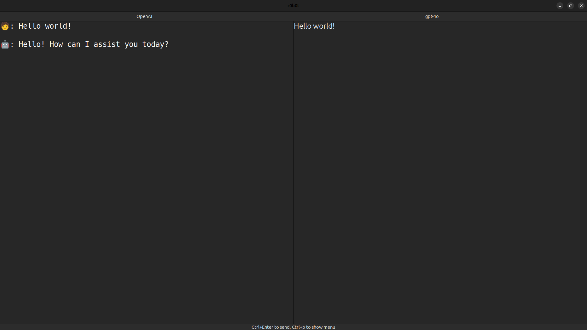

  

[![NuGet Version][nuget-version]][r0b0t]
[![NuGet Downloads][nuget-downloads]][r0b0t]

r0b0t is a GTK+ application for interacting with Large Language Models from OpenAI, and also with GitHub Copilot.

## Installation

- On Ubuntu requires `apt install appmenu-gtk3-module`
- create a `.env` file with variables `openai_key`, `github_key`, `huggingface_key` and `anthropic_key`, in the same directory where the program runs; or make sure at least one of them is defined when doing so.

[r0b0t]: https://www.nuget.org/packages/r0b0t
[nuget-version]: https://img.shields.io/nuget/v/r0b0t?style=flat-square
[nuget-downloads]: https://img.shields.io/nuget/dt/r0b0t?style=flat-square